# Project T.R.A.C.E.

> **T**ransparency • **R**esilience • **A**ccountability • **C**ommunity **V**erification • **E**conomic Growth

A modern full-stack Barangay Management System for Barangay Tumalaytay, built with PHP 8, MySQL, Bootstrap 5, and a glassmorphism-inspired UI.

```mermaid
flowchart TD
    README[README.md Structure] --> Header[Project Header]
    README --> Phases[Implemented Phases]
    README --> Features[Features]
    README --> QuickStart[Quick Start]
    README --> Structure[Project Structure]
    README --> Tech[Technology Stack]
    README --> License[License]

    Header --> Acronym[T.R.A.C.E. Definition]
    Header --> Desc[System Description]

    Phases --> P1[Phase 1: Planning & Requirements]
    Phases --> P2[Phase 2: UI/UX Design & Landing Pages]
    Phases --> P3[Phase 3: Database Design & Schema]
    Phases --> P4[Phase 4: Authentication & RBAC]
    Phases --> P5[Phase 5: Dynamic Landing Website CMS]
    Phases --> P6[Phase 6: QR Identification System]
    Phases --> P7[Phase 7: Resident Management]
    Phases --> P8[Phase 8: Document Management]
    Phases --> P9[Phase 9: Application Request System]
    Phases --> P10[Phase 10: Project Budget & Agenda Mgmt]
    Phases --> P11[Phase 11: Announcement System]
    Phases --> P12[Phase 12: Admin Dashboard & System Controls]

    Features --> RBAC[Role-Based Access Control]
    Features --> QR[QR Identification]
    Features --> Docs[Document Generation - 10 types]
    Features --> Apps[Application Workflow]
    Features --> Projects[Project Management]
    Features --> Budget[Budget & Expenses]
    Features --> Agenda[Agenda Management]
    Features --> Announce[Announcements - 7 types]
    Features --> Reports[Reports - 9 types]
    Features --> Audit[Audit Logs]
    Features --> Backup[Backup & Restore]
    Features --> Notify[Notifications]
    Features --> Analytics[Analytics]

    QuickStart --> Import[Import trace.sql]
    QuickStart --> Config[Configure constants.php]
    QuickStart --> Start[Start XAMPP]
    QuickStart --> Login[Login with default credentials]

    Structure --> Assets[assets/ - CSS, JS, uploads]
    Structure --> Config[config/ - Database, session, constants]
    Structure --> Includes[includes/ - Reusable PHP]
    Structure --> Admin[admin/ - Administrator modules]
    Structure --> Secretary[secretary/ - Secretary modules]
    Structure --> Resident[resident/ - Resident modules]
    Structure --> Landing[landing/ - Public pages]
    Structure --> Auth[auth/ - Authentication pages]
    Structure --> Database[database/ - SQL schema & seeds]
    Structure --> Index[index.php - Entry point]

    Tech --> PHP[PHP 8 Procedural]
    Tech --> MySQL[MySQL]
    Tech --> Bootstrap[Bootstrap 5]
    Tech --> BootstrapIcons[Bootstrap Icons]
    Tech --> JS[Vanilla JavaScript]
    Tech --> GD[PHP GD QR Generation]
```



## Implemented Phases

| Phase | Module | Status |
|-------|--------|--------|
| Phase 1 | Planning & Requirements | ✅ Complete |
| Phase 2 | UI/UX Design & Landing Pages | ✅ Complete |
| Phase 3 | Database Design & Schema | ✅ Complete |
| Phase 4 | Authentication & RBAC | ✅ Complete |
| Phase 5 | Dynamic Landing Website (CMS) | ✅ Complete |
| Phase 6 | QR Identification System | ✅ Complete |
| Phase 7 | Resident Management | ✅ Complete |
| Phase 8 | Document Management | ✅ Complete |
| Phase 9 | Application Request System | ✅ Complete |
| Phase 10 | Project, Budget & Agenda Management | ✅ Complete |
| Phase 11 | Announcement System | ✅ Complete |
| Phase 12 | Admin Dashboard & System Controls | ✅ Complete |

## Features

- **Role-Based Access**: Admin, Barangay Secretary, Resident
- **QR Identification**: Resident verification with QR codes
- **Document Generation**: 10 document types with auto-numbering and QR verification
- **Application Workflow**: Complete request routing from submission to completion
- **Project Management**: Timeline, budget, progress tracking, admin approval
- **Budget & Expenses**: Allocation tracking, expense recording, financial reports
- **Agenda Management**: Meeting scheduling, minutes, action items, attendance
- **Announcements**: 7 types with priority, audience targeting, read tracking
- **Reports**: 9 report types with CSV export
- **Audit Logs**: Full action tracking with IP and user agent
- **Backup & Restore**: Database SQL backup/restore with download
- **Notifications**: Real-time alerts with unread counter
- **Analytics**: Charts for demographics, applications, and system metrics

## Quick Start

1. Import `database/trace.sql` into MySQL
2. Configure `config/constants.php` with your database credentials
3. Start XAMPP and navigate to `http://localhost/FinalTrace`
4. Login with default credentials:
   - Admin: `admin@trace.test` / `password`
   - Secretary: `secretary@trace.test` / `password`
   - Resident: `resident@trace.test` / `password`

## Project Structure

```
FinalTrace/
├── assets/          # CSS, JS, uploads
├── config/          # Database, session, constants
├── includes/        # Reusable PHP components
├── admin/           # Administrator modules
├── secretary/       # Secretary modules
├── resident/        # Resident modules
├── landing/         # Public-facing pages
├── auth/            # Authentication pages
├── database/        # SQL schema and seed data
├── index.php        # Application entry point
├── requirements.md  # System requirements document
└── plan.docs        # Development plan
```

## Technology Stack

- PHP 8 (Procedural)
- MySQL
- Bootstrap 5
- Bootstrap Icons
- Vanilla JavaScript
- PHP GD (QR generation)

## License

This project is developed for Barangay Tumalaytay governance and public service.
